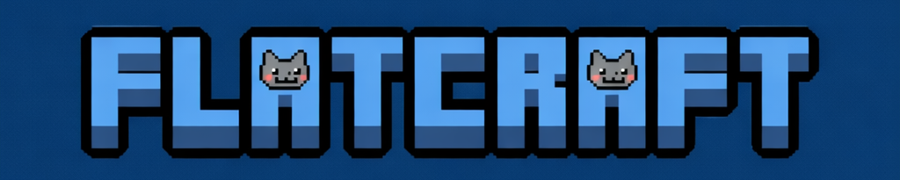

<div align="center">


<h3 align="center">
FlatCraft — это 2D-песочница с видом сверху и процедурной генерацией мира на базе фрактального шума Перлина.
</h3>
</div>

**Документация API:** https://mootsasa.github.io/FlatCraft_2D/

## Команда

*   **Артюхова Ульяна** ([@uliana_arty](https://t.me/uliana_arty)) — *Логика, алгоритмы, математика*
*   **Шамко Александр** ([@mootsasa](https://t.me/mootsasa)) — *Рендеринг, архитектура движка, UI*

---

## Запуск

```bash
python -m venv .venv
source .venv/bin/activate
pip install -r requirements.txt
python -m src.main
```

### Управление

| Действие                   | Клавиша | Геймпад    |
| -------------------------- | ------- | ---------- |
| Движение                   | ↑ ← ↓ → | Левый стик |
| Бег                        | Shift   | A          |
| Приближение/отдаление      | - / +   | RT / LT    |
| Монитор производительности | F3      | —          |
| Профилирование             | F4      | —          |
| Выход в меню               | Esc     | Start      |

Клавиши и кнопки геймпада можно переназначить на странице **Управление** в главном меню.

---

## Реализованные фичи

### Генерация мира

- Фрактальный шум Перлина с октавами — генерация карт высот, температуры и влажности
- Пересечение климатических карт формирует 10 биомов: океан, глубокий океан, пляж, пустыня, саванна, луг, лес, тайга, тундра, снежный биом
- Автотайлинг песка — плавные переходы между типами побережья (битовая маска по 4 соседям)
- Конфигурация генерации через `pydantic`: seed, размер мира, уровень моря, частота шума
- Мультипроцессинг при предвычислении градиентов шума

### Рендеринг

- Двухслойный рендер: поверхность (текстуры биомов) + объекты (деревья, кусты, камни и т.д.)
- Текстуры поверхности: трава (4 варианта), песок (3 варианта), океан, глубокий океан, лёд, саванна, снег
- Объекты: дуб, берёза, ясень, каштан, тополь, ива, баобаб, сосна, ель, кипарис, пальма, куст, кактус, тростник, перекати-поле, цветы, тундровые кусты, камни
- Детерминированный хеш для размещения объектов — одинаковый результат при одном seed
- Прогрессивная загрузка чанков

### Игровой персонаж

- Nyan Cat с анимацией в 8 направлениях
- Текстуры плывущего котика при движении по воде
- Скольжение по льду
- Звуки шагов по биомам (трава, песок, снег, лёд, вода)
- Звуки биомов с переходим
- Плавное затухание звуков при остановке

### Интерфейс

- **Главное меню** — выбор параметров генерации (seed, размер, уровень моря, частота шума) + рандомизация
- **Страница управления** — переназначение клавиш и кнопок геймпада с сохранением в JSON
- **Экран загрузки** — рандомный фон, прогресс-бар, падающий котик
- **Миникарта** — отображение мира с рамкой камеры, клик для перемещения
- **Монитор производительности** (F3) — FPS, количество тайлов, RAM
- **Профилировщик** (F4) — захват pyinstrument, HTML-отчёт в `output/profiling/`
- Музыка меню с fade-in/fade-out

### Технологии

- **Arcade 3.3.3** — OpenGL рендеринг, спрайты, GUI
- **NumPy + SciPy** — векторизованная интерполяция шума, сглаживание
- **perlin-noise** — градиентные векторы Перлина
- **pydantic** — валидация конфигурации генерации
- **psutil** — мониторинг RAM
- **pyinstrument** — профилирование

---

## Сборка (Nuitka)

```bash
# Linux
./scripts/build.sh

# macOS
./scripts/build_macos.sh

# Windows
scripts\build.bat
```

Выходной файл: `builds/flatcraft` (Linux), `builds/flatcraft.app` (macOS), `builds/flatcraft.exe` (Windows).

> На macOS без code signing приложение покажет предупреждение. Запустите через
> Правый клик → Открыть или выполните `xattr -cr builds/flatcraft.app`.

---

## CI/CD

- **Lint** — flake8 + mypy запускаются при каждом push и PR
- **Build** — сборка Nuitka (Windows, Linux, macOS) запускается вручную или при пуше тега `v*`
- **Release** — при пуше тега `v*` автоматически создаётся GitHub Release с бинарниками для всех платформ
- **Docs** — Sphinx-документация деплоится на GitHub Pages при пуше в main

```bash
git tag v0.2.0
git push origin v0.2.0
# → линтеры → сборка Win/Linux/macOS → релиз с .exe + binary + .app.zip
```

---

## Структура проекта

```
src/
├── main.py                  # Точка входа
├── engine/
│   ├── game_window.py       # Главное окно, игровой цикл
│   ├── renderer.py          # Двухслойный рендер мира
│   ├── camera.py            # 2D-камера с зумом
│   ├── player.py            # Nyan Cat: анимация, звуки, движение
│   ├── input_manager.py     # Клавиатура + геймпад + переназначение
│   ├── loading_screen.py    # Экран загрузки
│   └── layers.py            # Типы объектов, правила размещения
├── world/
│   ├── models.py            # Biome, Tile, Chunk, World
│   ├── generator.py         # Генератор мира (шум + климат + биомы)
│   └── autotiler.py         # Автотайлинг песка
├── ui/
│   ├── main_menu.py         # Главное меню + страница управления
│   ├── hud.py               # Координатор интерфейса
│   ├── minimap.py           # Миникарта
│   └── performance_monitor.py # Монитор производительности
└── utils/
    ├── noise.py             # Фрактальный шум Перлина
    └── profiling.py         # Профилировщик pyinstrument
```

---

## Лицензия

MIT License — см. [LICENSE](LICENSE).
